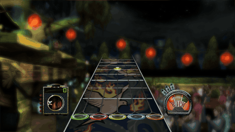
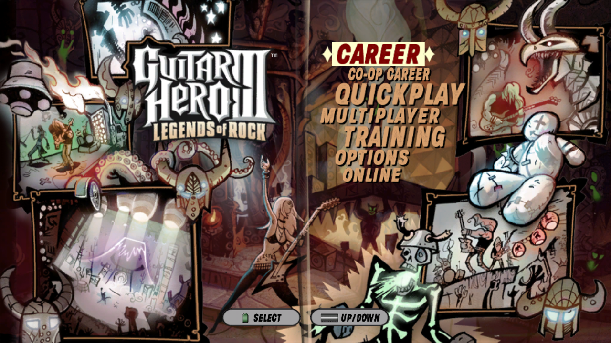
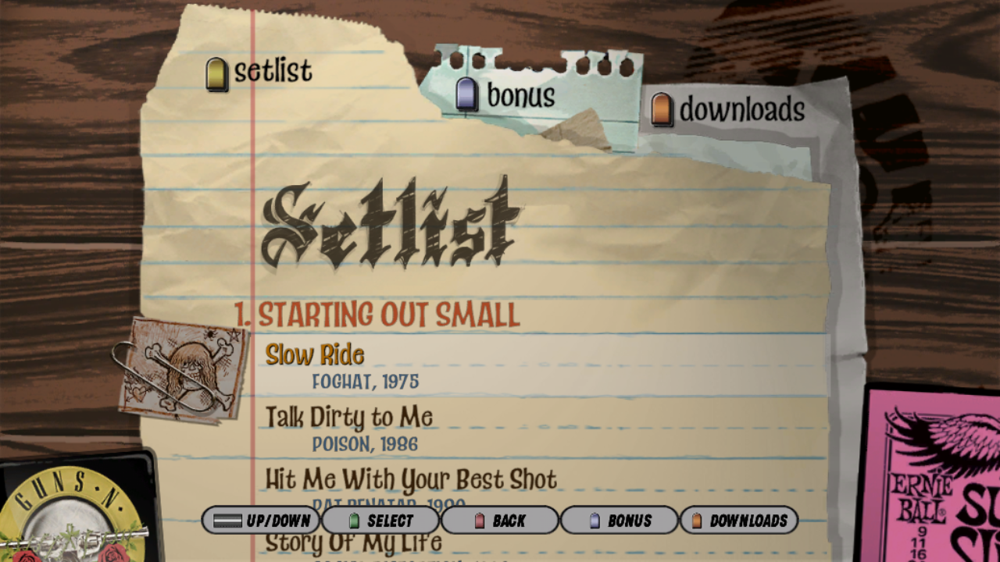
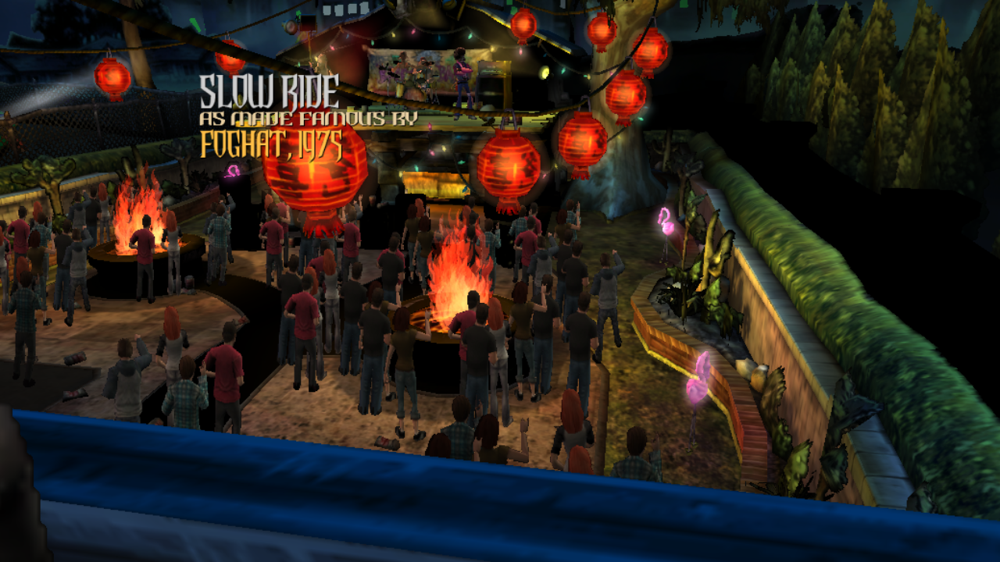
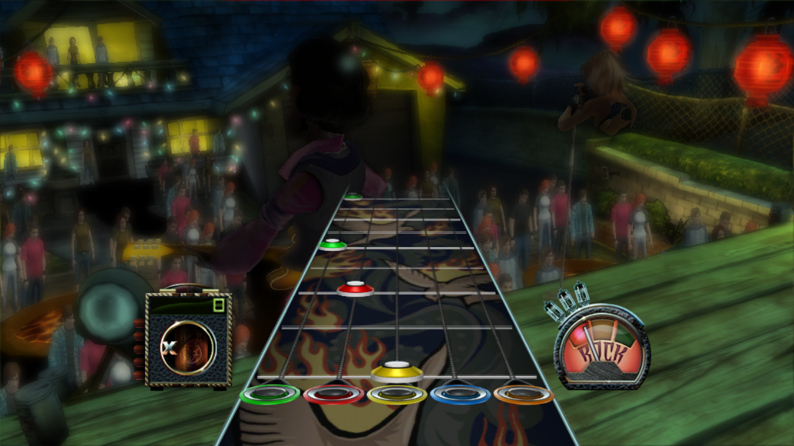

# gh3 — Guitar Hero III: Legends of Rock (PS3), static recompilation

`BLUS30074`, disc release. Recompiled with
[ps3recomp](https://github.com/sp00nznet/ps3recomp). Day one of this port.



| | |
|---|---|
|  |  |
|  |  |
|  |  |

The window title shows the presented FPS, the draws in the last frame and the
backbuffer size, e.g. `Guitar Hero III: Legends of Rock | FPS: 40.12 | draws: 1492 | 1280x720`.

## Why this title

Picked over Rock Band 3 on measurement rather than taste. Both are "big game,
simple engine" on paper; they are not the same target:

| | code | functions | SPU markers | imports |
|---|---|---|---|---|
| Simpsons Arcade *(playable)* | 1.3 MB | 5,019 | few | — |
| **Guitar Hero III** | 9.7 MB | **28,987** | **7** | 229 |
| Rock Band 3 | 13.6 MB | 32,128 | **104** | 297 |

Rock Band 3 runs Sony's MultiStream (`cellMS*`) audio middleware on the SPUs —
104 markers — and in a rhythm game the audio path *is* the critical path. That
is the same shape that has Virtua Fighter 5 and Tokyo Jungle stuck. GH3 has 7.

## Status: gameplay renders complete at ~40 fps

2026-09-25: the save loads, the menus work, and Quickplay → Easy → Slow Ride
plays with the venue, band, highway, fret buttons, strings, gems, HUD and audio.

**Frame rate** went from 7–9 fps to about 40 fps in gameplay:

| Cause | Fix |
|---|---|
| Nothing was optimised. The CMake caches carry empty `CMAKE_{C,CXX}_FLAGS_RELEASE`, and clang-cl without `/O` is `/Od` | `-O2` added explicitly here and in ps3recomp |
| ~700 `getenv()` diagnostic gates, several per draw or per syscall. The UCRT scan was ~30% of the main PPU thread and ~35% of the RSX thread | `__imp_getenv` is a lock-free cache (boot_main.cpp) |
| `[RSX null]` / `[evt]` lines printed every frame through stderr's lock | gated behind `ps3_log_verbose()` |

Now the main PPU thread spends most of a frame in `func_0001A66C`, which waits
for the SPU job queue to drain (a 100 µs usleep poll). The SPURS job threads
are the next bottleneck.

**The venue in gameplay** was black. The full-screen draw over it (`pso_key`
`ab823ddcaca097e6`) is the `bg_viewport` ViewportElement, parked off-screen in
`ui_clip_root`. The engine hides it with a scissor of width and height 0. The
live renderer read a zero-size scissor as "no scissor", so the empty
render texture covered the screen. A written scissor of zero now clips everything.

**The fretboard** (fret buttons, strings, fret lines) was missing. Those sprites'
fragment programs sample with `TXB` (LOD bias), which the FP decompiler didn't
handle, so they came out with alpha 0. `TXB`/`TXL` now map to
`SampleBias`/`SampleLevel`.

## Earlier: intro movies play, reaches attract mode

2026-09-24: the full boot runs unattended. The four Bink movies (ATVI, RO_LOGO,
NS_LOGO, INTRO) play with sound. The title screen comes up, and after the idle
timeout the game loads the attract demo: Art Deco venue, *The Seeker*, and the
full band. It then shows attract mode's "Press any button to rock" overlay. The
venue issues about 200 draw groups a frame, but they don't reach the screen, so
the overlay sits on black. That's next.

What stood between the title screen and attract mode, in order (fixes are in
ps3recomp unless noted):

| Symptom | Cause |
|---|---|
| Movies never opened | USRDIR flattening mapped to `<root>/USRDIR`, but this tree is disc layout (`PS3_GAME/USRDIR`) |
| Movies rendered solid green | `fread` past the CRT buffer goes straight to `ReadFile`, and a kernel write into a not-yet-committed VM page fails. Bink got a short read, flagged ReadError and skipped every frame |
| Movie froze at frame 60 | Lifter replaced a spill reload `ld r23,0x918(r1)` with the entry value of r23 from its restore slot (0x888). Bink's row loop never hit zero |
| Froze on job 41 | A new SPU job body (0x14B91980), captured with `SPU_DUMP_OVL` and lifted as image 12 (this repo) |
| Havok collide task spun forever | `MFC_RdAtomicStat` returned 0 after GETLLAR; hardware returns 4, and Havok's allocator loops until it sees it |
| Physics step never finished | `cellSpursCreateTask` never freed a task id. Havok creates one per step, so step 128 failed |
| Integrate task spun on a ticket lock | PPU `cellSyncMutexUnlock` (HLE CAS) raced SPU PUTLLC on the same mutex and was overwritten |
| Run crawled at 4 fps unattended | Monitor asleep throttles vsync'd Present; the runtime now keeps the display awake |
| Whole process froze at 0% CPU | The watchdog printed while a thread was suspended, and that thread held stderr's lock |

The rest of this file is the earlier history, kept because it records what was
measured.

| Step | State |
|---|---|
| `EBOOT.BIN` → plain ELF | **done** — disc SELF (`type=APP`, key_rev 0x1c), no NPDRM |
| Imports | **done** — 229 across 18 libraries, 204 named (89%) |
| Function discovery | **done** — 28,162 found, 27,137 `.opd` descriptors as ground truth |
| PPU lift | **done** — 28,987 functions, 6 chunks, 193 MB of C++, 6 continuation warnings |
| Build & link | **done** — first attempt, 13/13, **nothing title-specific in the tree** |
| Boot | **runs** — 17 system modules, `cellGame` check passes, `sceNp` init, window open, ~63 fps |
| Assets | **loaded** — 14 files, every read complete, zero failures |
| Render | **draws** — the animated loading record is on screen |
| Frontend | **not reached** — with `PS3_NULL_SWEEP=1` the guest is healthy and the blocker is the decompression wait; without it a bad container pointer memsets 82 MB over the image |

## Where it stops: a vtable used as an object, during startup init

The stall is not in the decompressor's SPU job. It is a `memset(NULL, 0, ~10MB)`
that the decompressor path makes on the main thread, and what that memset
destroys.

The engine's array allocator gets 0 back from the heap and memsets the null
buffer without checking. The arguments, read off the failing call:

```
memset(dst = 0x00000000, c = 0, len = 0x05241D48)    82 MB, over a null pointer
```

The sweep runs UP from address 0. On real
hardware the first store faults; here the whole 32-bit guest space is backed, so
it runs silently through the unused copy of the code image and then straight
through this title's data segment at `0x009D0000` -- which holds `.data`, `.opd`
**and the TOC** (`0x00A483A8` is inside `ph1` = `0x009D0000..0x00A4E130`).

Verified both ways: the ELF has `{0x004AFCAC, 0x00A483A8}` at `0x00A24868`, a
perfectly good function descriptor; the running guest reads all zeros there.

After that every TOC-relative global in the game reads 0. That is the source of
every other symptom, and each of them cost a session of its own before this was
found:

| symptom | actually |
|---|---|
| ~20 million `[null-read]` per boot from `func_00261F54` | it walks a table whose TOC base was zeroed |
| four allocator pool globals `0x104306E4/E8/EC/F0` null | never written *and* the pool feature is off by config |
| vtable dispatch to address 0 in `func_00649694`, `func_00663B84` | their TOC-resident objects were zeroed |

`runtime/ppu/ppu_loader.cpp` now reports and DROPS a guest store into the first
page (`[null-write]`, `PS3_NULL_WRITE=0` to disable), so this class of failure
announces itself instead of presenting as five unrelated bugs in five
subsystems.

### `PS3_NULL_SWEEP=1` -- what the corruption was hiding

The memset over the image is containable. On real hardware the first store
through the null pointer faults and the memset never continues; the runtime now
has an opt-in guard that drops the rest of the sweep once a null-page store is
seen. Same 140 s run, with and without:

| | without | with |
|---|---|---|
| `.opd` descriptor read as zero | 6204 | **0** |
| guest reads through NULL | ~20,000,000 | **16** |
| calls through a NULL pointer | 10 | **0** |
| `bctr` to address 0 | many | **0** |
| frames presented | 2304 | **8544** |

So that single memset caused every other symptom, and with it contained the
guest runs clean and 3.7x faster (those 20 M null reads were pure CPU burn).

It does **not** reach the frontend. The title loads the same 17 files -- through
`GLOBAL.PAB` and a 24 MB read of `GLOBAL_VRAM.PAK` -- renders the legal screen
and loading wheel, and parks the main thread at `lr = 0x004BF8F0`, inside
`func_004BF614`'s poll loop (`goto loc_004BF800`). That is the decompression
wait: the blocker is now the original one, reached with a healthy guest instead
of a shredded image.

### What the main thread is waiting for

Pinned exactly. `func_0001A66C(jobid)` is the blocking wait: it finds its slot
as `[[TOC-0x7E84] + 0x118] + jobid*32` and spins until
`[slot+0] + [slot+0x1C] == 0`. At the stall:

```
job manager        0x101FF000        [TOC-0x7E84]
job array base     0x13598A00        [0x101FF118]
polled slot        0x13598CC0        job 22
  [slot+0]    = 0
  [slot+0x1C] = 1                    <- never reaches 0
```

The PPU only ever writes `[slot+0] = 1` (submit, four times) and zeroes the
pair once at init. The values the poll actually sees -- `+0` cleared and
`+0x1C` set -- are ones the PPU never wrote, so the **SPU** took the job by DMA
(invisible to `PPU_WWATCH`, which only sees lifted PPU stores) and marked it in
progress, then never completed it.

On the SPU side the matching symptom is a task that never does any work: task 0
of taskset `0x14BB2000` enters `WAIT_SIGNAL` **31,000 times** with `ran=0ms`
against 24 signals sent -- it parks, is woken, runs nothing, re-parks. The
existing `SPURS_EF_SPU_REPLY=2` probe does not fire for it (its wait object is
zero), so that path does not apply.

### The SPU side: a livelock on the job queue head

The job policy module (image 6) is not idle and not stuck in a wait -- it is
spinning on a lock-line atomic:

```
[putllc-ok] 62800001: img=6 ea=0x101FF100      62.8 MILLION successful PUTLLCs
```

`0x101FF100` is the job queue header inside the job manager at `0x101FF000`.
The PPU sets it up and submits into it (`0x101FF118` = array base `0x13598A00`,
`0x101FF11C` = 0x3E = 62 slots, then `0x101FF104`/`0x101FF110` = 1 per submit).
The SPU takes the line, succeeds at the atomic, and goes round again forever.
The PUTLLCs SUCCEED -- this is not the reservation-loss livelock the repo has
hit before, it is a loop that makes no progress while winning every atomic.

It does do real work first: `cmd=0x40` GETs pull 16 KB input chunks into LS
`0x8880`..`0x14880` and `cmd=0x20` PUTs write 16 KB output chunks back, 22 in
and 35 out. That is only ~0.5 MB of a 24 MB file, so it stalls EARLY in the
decompression, not at the end.

Dumping the line the atomic writes settles what the SPU actually sees:

```
0x101FF100:  0 0 0 0 | 0 0 | 13598A00 | 0000003E
                             array base  62 slots
```

So **coherency is fine** -- the base and slot count the PPU wrote are visible to
the SPU -- and the submit flags at `+0x04` and `+0x10`, which the PPU set to 1,
read back as 0: consumed. The SPU took the job, did its ~0.5 MB of work, and
returned to the poll loop without completing it. No lifting gap is involved:
the run reports no SPU miss, no interpreter fallback and no branch-to-0, so the
job body runs fully lifted.

What is missing is the completion. The SPU never PUTs to the job array at all
(one GET of `0x13598CC4`) and takes no atomic on the slot's lock line -- the
only atomics in the run are `0x101FF100` and one `0x107B7800`. Yet the polled
slot reads `[+0]=0, [+0x1C]=1`, values neither side wrote through anything this
runtime traces. Finding the write that does land there is the next step.

`0x101FF100` has a history of four wrong readings in earlier sessions ("full
ring nobody drains", "no PPU consumer", "62-item work list consumed to item
46", "SPU advances the consumer index"). Measure it; do not narrate it.

**Build note:** `gh3` links a PREBUILT `build-gate/ps3recomp_runtime.lib`. Only
`runtime/ppu/*.cpp` is compiled into the port directly, so a change to
`runtime/spu/*` needs `ninja -C build-gate ps3recomp_runtime` before relinking,
or the run silently uses the old code.

Three imports are also unresolved, one called 38 times -- `0xDF6476BD`
(cellGcmSys), `0x32B94ADD` (cellSpurs), `0x6C960F6D`
(`cellSpursGetSpuThreadId`).

### What is NOT wrong (measured, so it does not get re-derived)

- The per-thread allocator stack works. `func_004B4908` returns `r13-0x6FF8`,
  the stack top lives at TLS+0x4C, `func_004D6A60`/`func_004D6BD8` push and pop.
  A watch on the main thread's real TLS block shows depth 1/2/3 with real
  allocator objects (`0x106A6C88`, `0x110010D0`).
- The global allocator singleton `0x106A6BF0` is constructed (`<- 0x106A6DE8`).
- `func_00267BEC` (which allocates four memory pools) early-outs on a byte at
  `0x10683F82` -- but that byte is a parsed config option `func_004B98DC`
  deliberately sets to 0. Off by design in a retail build.
- The guest heap syscalls are fine; lv2 hands out `0x40000000+`.

**Watch the right TLS block.** GH3's main thread runs on `r13 = 0x0E007000`,
from `sys_initialize_tls` -- not `PPU_TLS_TP` (`0x10F07000`). Four write watches
aimed at the wrong block all read as "nothing ever writes this", which is how
the allocator stack got blamed. `[GSTACK]` now prints `r13` and `tid`.

### Where it is called from

A back-chain walk (`[GSTACK] chain:`, ELFv1: back chain at `[sp]`, lr at
`back_chain+0x10`) gives the real callers, ending at the CRT entry:

```
<reader> <- func_00648A30+0x7C <- func_00664C38+0x254 <- func_0023EE10+0x8C
         <- func_0005AC94+0x64 <- func_0005BFC0+0xD0 (x2) <- func_00064288+0xC0
         <- func_00069DFC+0xAE8 <- func_0006AC90+0x1D0 <- func_0006B654+0x3A8
         <- func_002898C4+0x3DC <- func_002877CC+0xD0 <- func_0028BB14+0x18C
         <- func_00526AB4+0x4F8 <- func_00113BB4+0x100 (x4)
         <- func_005229A4+0xD80 <- func_00010250+0x154 <- func_00010244+0x8
```

**This is startup init, not decompression.** `func_005229A4` is the same init
function that calls the memory-pool setup. `func_004BF614`, the decompressor,
is not in the chain at all -- that attribution came from the stack SCAN, which
reports any stack word that looks like a return address, dead slots included.

Two traps, both of which produced confident wrong answers here:

- **The walk was silently truncated.** Both walkers filtered candidate return
  addresses with a hardcoded `< 0x600000`. This title's text runs to
  `0x009CD550`, so every frame between the two was dropped -- most of the
  engine. Four walks from four different frames returned the IDENTICAL chain,
  which is the tell. The bound now comes from the function table
  (`ppu_code_hi()`); the first three frames above only appeared after that fix.
- The walk prints RETURN addresses, so the innermost frame -- the function that
  actually made the failing call -- is the one missing from the top.

### Root cause: a vtable address used as an object pointer

Something is holding `r25 = 0x101047A0` and reading `[r25 + 0x18]` as data.
That address is a **vtable** -- all twelve slots inspected are `.opd`
pointers:

```
0x101047A0 +0x00 00A331D0  +0x04 00A331B0  +0x08 00A0FE00  +0x0C 00A33130
           +0x10 00A33138  +0x14 00A33198  +0x18 00A331A0  +0x1C 00A33140
           +0x20 00A33148  +0x24 00A331A8  +0x28 00A33190  +0x2C 00A32FB0
```

The read is `table = [r25 + 0x18] + 0xC` -- **vtable slot 6**, a function
descriptor address, used as an object. Everything after that is mechanical:

```
[r25+0x18]   = 0x00A331A0   vtable slot 6 = OPD for code 0x0074DAB0
table        = 0x00A331AC   = that OPD + 0xC, i.e. inside .opd
[table+4]    = 0x0074DAE8   the NEXT descriptor's code, read as the load
[table+8]    = 0x00A483A8   the NEXT descriptor's TOC,  read as the capacity
cap*2 + 2    = 0x01490752   the rehash count            -> 164 MB, refused
count << 2   = 0x05241D48   the memset length, measured ->  82 MB, over NULL
```

Every value verified against the raw ELF bytes.

**So the whole boot failure is one bad object pointer**: something holds a
vtable address where an object belongs, which is what `*(obj)` gives you if it
is dereferenced once too many.

**How `r25` becomes a vtable is unresolved, and the obvious reading is wrong.**

Call SITES are solid now that the walk is fixed (the walk prints return
addresses, so each entry names where the frame below it was called from):

```
func_00647BEC   <- called at 0x00663A40, in func_006637AC
                <- called at 0x00648AA8, in func_00648A30
                <- called at 0x00664E88, in func_00664C38
                <- called at 0x0023EE98, in func_0023EE10   (startup init)
```

`func_006637AC` does `r25 = r3` at entry -- the only place it sets r25 -- and
later `table = [r25 + 0x18] + 0xC`. With `r25 = 0x101047A0` that reads
`0x101047B8` = `0x00A331A0`, giving exactly the measured `0x00A331AC`. A read
watch confirms `0x101047B8` is read exactly once.

But `func_006637AC` is **never entered with any vtable**. It reads `[r3+0x78]`
unconditionally two lines after `r25 = r3`, and a read watch over the whole
region `0x10104340..0x10104840` catches only five reads, none of them at
`+0x78` of any of the three candidate vtables.

Do not conclude "a callee clobbered r25" without checking: `func_006637AC`
makes exactly two calls, both to `func_00647BEC`, and nothing in that subtree
(`func_00647BEC`, `func_00649694`, `func_006495CC`, `func_0065AA24`, the
memset) writes r25 at all. `func_006479BC` does write r25 as scratch, but it
restores it at its single exit.

**Caution for the next attempt:** the memset runs INSIDE `func_006479BC`, after
that scratch write -- so r25 in any sample taken during the memset is
`func_006479BC`'s scratch, not the object. Several readings here conflated the
two. Sample r25 at `func_00647BEC`'s entry instead, and treat the sampled
`guest-fn` as a hint (identical code folding makes it ambiguous).

### Heap selection works; the null heap is a red herring

Heaps are picked by matching r13 against a table of registered thread pointers
at `[[TOC+0x3734] - 0x8000]`. Measured: tids 1, 7 and 8 each register and get
heaps A/B/C (`0x107BC2E0/E4/E8` <- `0x110BDAF0`, `0xD00B5C90`, `0xD00F6BE0`),
long before the failure and never zeroed. The DEFAULT slot `0x107BC2EC` is never
written -- by design.

## Building

```bash
./tools/relift.sh                     # imports.json, functions.json, lifted tree, NID table
cmake -S . -B build -G Ninja -DCMAKE_C_COMPILER=clang-cl -DCMAKE_CXX_COMPILER=clang-cl
cmake --build build
PS3_VFS_ROOT=vfs RSX_LIVE_DRAW=1 ./build/gh3 vfs/PS3_GAME/USRDIR/EBOOT.elf
```

`--code-end 0x9B3F38` in `relift.sh` is load-bearing: it sits just past the
`.lib.stub` import trampolines (`0x9B2298..0x9B3F38`) so `--hle-stubs` has
something to rewrite, and no further, because everything above is `.rodata` in
the same R-X segment — the data-as-code trap that cost flOw and YDKJ
multi-gigabyte lifts.

## Legal

No game code, assets or keys here — only analysis and build configuration.
Supply your own legally dumped disc.
